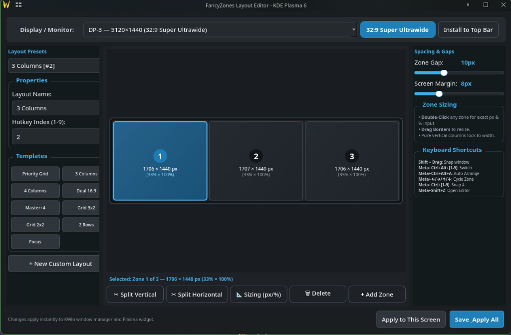

# FancyZones for KDE Plasma 6 🚀

<div align="center">
  <p><strong>A PowerToys-style FancyZones snapping experience, visual layout editor, and top-bar widget built natively for KDE Plasma 6 on Wayland & X11.</strong></p>
  <p>Optimized for <strong>32:9 Super Ultrawide</strong>, <strong>21:9 Ultrawide</strong>, and <strong>Multi-Monitor</strong> workflows.</p>
</div>

---

<p align="center">
  
</p>

---

## ✨ Features

- 🎯 **Shift-Only Snapping**: Windows move freely during normal dragging. Holding **`Shift`** activates high-performance, native compositor tiling.
- 📐 **Interactive Visual Layout Editor**:
  - **Drag-to-Resize Borders**: Hover near any border or splitter between zones to resize adjacent zones live.
  - **Exact Pixel & Percentage Displays**: Shows real-world screen dimensions (e.g. `1706 × 1406 px  (33% × 100%)`) updated in real-time.
  - **Double-Click Dimensions Modal**: Double-click any zone for direct manual input in pixels or percentage, with smart context-aware inputs for columns and rows.
- 🖥️ **Full-Screen 0.5s Visual HUD Preview**: Switching layouts flashes full-size glowing zone overlays with zero window disruption or focus stealing.
- ⊞ **Minimalist Top Bar Widget**: Minimal 4-quadrant icon for Plasma panels with full-width preset cards and quick controls.
- ⌨️ **Global Keyboard Shortcuts**: Instant preset switching, auto-arranging, and direct zone jumping.
- 🖥️ **Curated 32:9 Super Ultrawide Presets**:
  - `Priority Grid` (25% / 50% / 25%)
  - `3 Columns` (33.3% / 33.4% / 33.3%)
  - `4 Columns` (25% / 25% / 25% / 25%)
  - `Dual 16:9 Split` (50% / 50%)
  - `Master + 4 Flanks`
  - `Grid 3×2`
  - `Grid 2×2`
  - `2 Rows`
  - `Focus Zone`

---

## 📦 Quick Install (One-Liner)

To install FancyZones on any KDE Plasma 6 system:

```bash
git clone https://github.com/cromewar/fancy-zones-kde.git && cd fancy-zones-kde && ./bin/install.sh
```

### 🔄 Updating Existing Installations

If you already have FancyZones installed, you can update to the latest version by running either:

```bash
# Inside the cloned fancy-zones-kde directory:
./bin/update.sh
```

Or using the CLI tool:

```bash
fancyzones-ctl update
```

Or as a quick one-liner:

```bash
cd ~/fancy-zones-kde 2>/dev/null || cd $(find ~ -maxdepth 3 -name fancy-zones-kde -type d 2>/dev/null | head -n 1) && git pull && ./bin/install.sh
```

### Dependencies
- **KDE Plasma 6** (`kwin_wayland` / `kwin_x11`, `plasmashell`)
- **Python 3.10+**
- **PyQt6** or **uv** (`curl -LsSf https://astral.sh/uv/install.sh | sh`)

---

## ⌨️ Keyboard Shortcuts

| Shortcut | Action |
| :--- | :--- |
| **`Shift + Drag Window`** | Snap dragged window into zone |
| **`Meta + Shift + Z`** | Open Visual Layout Editor |
| **`Meta + Ctrl + Alt + 1`** | Switch to **Priority Grid** (50% Center, 25% Flanks) |
| **`Meta + Ctrl + Alt + 2`** | Switch to **3 Columns** (33% each) |
| **`Meta + Ctrl + Alt + 3`** | Switch to **4 Columns** (25% each) |
| **`Meta + Ctrl + Alt + 4`** | Switch to **Dual 16:9 Split** (50% each) |
| **`Meta + Ctrl + Alt + 5`** | Switch to **Master + 4 Flanks** |
| **`Meta + Ctrl + Alt + 6`** | Switch to **Grid 3×2** |
| **`Meta + Ctrl + Alt + 7`** | Switch to **Grid 2×2** |
| **`Meta + Ctrl + Alt + 8`** | Switch to **2 Rows** |
| **`Meta + Ctrl + Alt + 9`** | Switch to **Focus Zone** |
| **`Meta + Ctrl + Alt + A`** | **Auto-Arrange** open windows into active zones |
| **`Meta + ← / →`** | Cycle active window across zones (Left / Right) |
| **`Meta + ↑ / ↓`** | Cycle active window across zones (Up / Down) |
| **`Meta + Ctrl + 1..6`** | Snap active window directly to Zone 1–6 |

---

## 🛠️ Architecture

- **`kwin-script/`**: KWin QML/JavaScript snapping engine with multi-pass constraint convergence.
- **`plasmoid/`**: Plasma 6 top-bar applet (`org.kde.plasma.fancyzones`).
- **`editor/`**: PyQt6 visual layout designer with drag-resizing and manual dimension modals.
- **`daemon/`**: Background DBus daemon (`org.kde.FancyZones /Manager`) handling full-screen 0.5s previews and IPC.

---

## 📄 License
MIT License. Created for the KDE Plasma 6 community.
